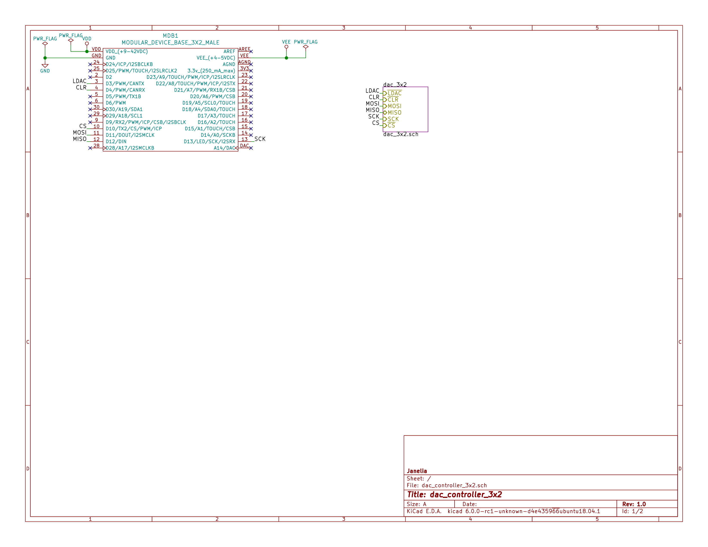
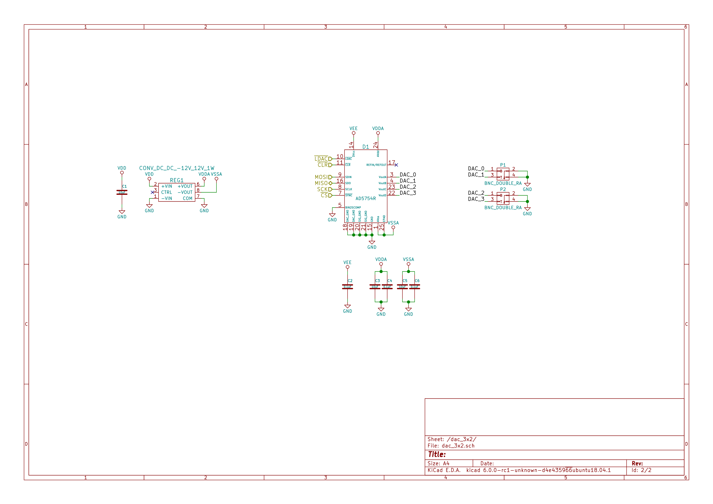
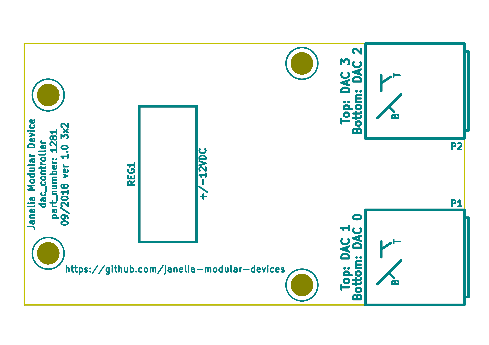
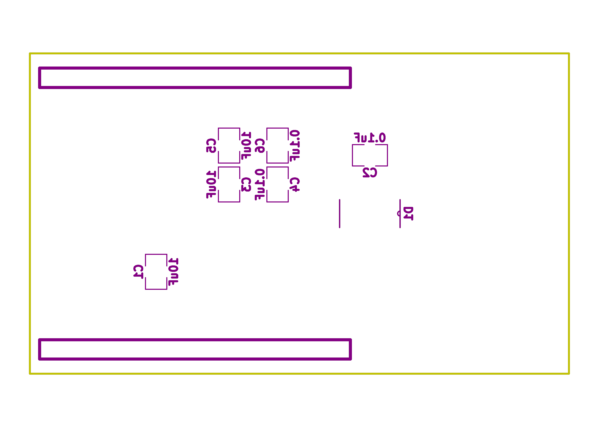

- [Repository Information](#org372c64f)
  - [Description](#orgae9022b)
- [Images](#org44ae73a)
- [Schematic](#orga211832)
- [Gerbers](#org3493c07)
- [Bill of Materials](#org3fd8118)
  - [PCB Parts](#org3846433)
  - [Supplemental Parts](#org2a14c79)
  - [Vendor Parts Lists](#org9ceb174)
- [Supplemental Documentation](#org9992682)
  - [Assembly Instructions](#org5a3e1bd)

# Repository Information

-   **Name:** dac\_controller\_3x2
-   **Version:** 1.0
-   **License:** Open-Source Hardware
-   **URL:** <https://github.com/janelia-kicad/dac_controller_5x3>
-   **Author:** Peter Polidoro
-   **Email:** peter@polidoro.io

## Description

This board controls four 16-bit unipolar/bipolar voltage DAC output channels.

# Images

# Schematic

[./schematic/dac\_controller\_3x2.pdf](./schematic/dac_controller_3x2.pdf)

# Gerbers

Send gerbers zip file to your favorite PCB manufacturer for fabrication.

[./gerbers/dac\_controller\_3x2\_v1.0.zip](./gerbers/dac_controller_3x2_v1.0.zip)

# Bill of Materials

## PCB Parts

| Item | Reference(s) | Quantity | PartNumber             | Vendor  | Description                               |
|---- |------------ |-------- |---------------------- |------- |----------------------------------------- |
| 1    | C1 C3 C5     | 3        | 445-4536-1-ND          | digikey | CAP CER 10UF 50V 10% X7S 1210             |
| 2    | C2 C4 C6     | 3        | 399-13229-1-ND         | digikey | CAP CER 0.1UF 50V 10% X7R 1210            |
| 3    | D1           | 1        | AD5754RBREZ-REEL7CT-ND | digikey | IC DAC 16BIT DSP/SRL 24TSSOP              |
| 4    | MDB1         | 2        | S1011E-16-ND           | digikey | 16 Position Header Through Hole Male Pins |
| 5    | P1 P2        | 2        | ACX1655-ND             | digikey | CONN BNC JACK R/A 75 OHM PCB              |
| 6    | REG1         | 1        | 945-1579-5-ND          | digikey | DC DC CONVERTER +/-12V 1W                 |

## Supplemental Parts

| Item | Quantity | PartNumber  | Vendor  | Description                     |
|---- |-------- |----------- |------- |------------------------------- |
| 1    | 4        | 290-1026-ND | digikey | CBL ASSY BNC PLUG-PLUG RG59 6FT |

## Vendor Parts Lists

[./bom/digikey\_parts.csv](./bom/digikey_parts.csv)

[./bom/supplemental\_digikey\_parts.csv](./bom/supplemental_digikey_parts.csv)

# Supplemental Documentation

## Assembly Instructions

-   Solder surface mount and through hole components onto the pcb.
